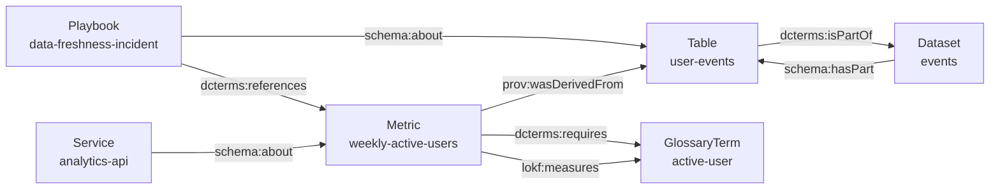

# Example bundle

[`examples/acme-knowledge/`](https://github.com/nicholsn/lokf/tree/main/examples/acme-knowledge)
is a conformant six-concept reference bundle for a fictional data org. It
exercises every headline feature: typed relationships, type-specific fields,
authorship, and citations.

```text
examples/acme-knowledge/
├── index.md                          # bundle root: base_iri, context, publisher
├── log.md
├── datasets/events.md                # Dataset
├── tables/user-events.md             # Table with a fields: schema
├── metrics/weekly-active-users.md    # Metric with formula, unit, provenance
├── glossary/active-user.md           # GlossaryTerm with definition
├── playbooks/data-freshness-incident.md  # Playbook
└── services/analytics-api.md         # Service with endpoint
```

## The graph it produces

Six markdown files, one knowledge graph. Every edge below is a typed
frontmatter field, not prose:



## One concept, end to end

The bundle's north-star metric, exactly as committed:

```markdown title="examples/acme-knowledge/metrics/weekly-active-users.md"
--8<-- "examples/acme-knowledge/metrics/weekly-active-users.md"
```

Attach the generated context and expand, and that one file yields these
triples (`examples/weekly-active-users.nt`, committed output of `just build`):

```text title="examples/weekly-active-users.nt"
--8<-- "examples/weekly-active-users.nt"
```

## Rebuild it yourself

```bash
just build
```

assembles the bundle (`examples/acme-knowledge.bundle.json`), validates it
against the `KnowledgeBundle` root — `No issues found` — and re-emits both
RDF projections: `examples/acme-knowledge.nt` (86 triples for the whole
bundle) and `examples/weekly-active-users.nt` (22 triples for the metric
alone).
