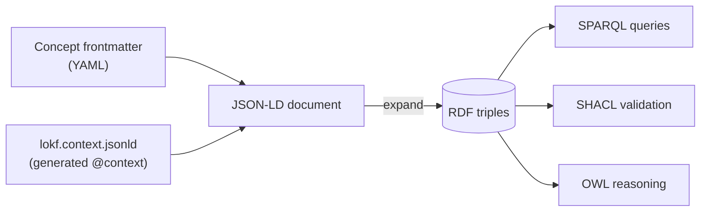

# Markdown to RDF

This is the mechanism that makes LOKF both "markdown-friendly" and
"RDF-native".

## The identity: frontmatter + context = JSON-LD

A JSON-LD document is just JSON plus an `@context` that maps its keys to IRIs.
LOKF's frontmatter keys are precisely the LinkML slots, and the generated
`lokf.context.jsonld` maps each of them to its `slot_uri`. Therefore:



No new syntax, no parallel file. The author writes OKF; the context supplies
the meaning.

## Worked example

The frontmatter of the reference bundle's WAU metric (abridged — see the
[full file](../examples.md#one-concept-end-to-end)), and the triples it
expands to:

=== "Frontmatter (YAML)"

    ```yaml
    ---
    type: Metric
    id: https://acme.example/knowledge/metrics/weekly-active-users
    title: Weekly Active Users
    unit: users
    tags: [growth, engagement]
    timestamp: 2026-06-30T12:00:00Z
    author:
      - type: Person
        id: https://acme.example/people/jsmith
        name: Jordan Smith
    measures:      [ https://acme.example/knowledge/glossary/active-user ]
    derivedFrom:   [ https://acme.example/knowledge/tables/user-events ]
    dependsOn:     [ https://acme.example/knowledge/glossary/active-user ]
    ---
    ```

=== "RDF (Turtle, abridged)"

    ```turtle
    <…/metrics/weekly-active-users> a lokf:Metric .
    <…/metrics/weekly-active-users> schema:name "Weekly Active Users" .
    <…/metrics/weekly-active-users> schema:unitText "users" .
    <…/metrics/weekly-active-users> schema:keywords "growth", "engagement" .
    <…/metrics/weekly-active-users> schema:dateModified "2026-06-30T12:00:00Z"^^xsd:dateTime .
    <…/metrics/weekly-active-users> schema:author <…/people/jsmith> .
    <…/people/jsmith> a schema:Person ; schema:name "Jordan Smith" .
    <…/metrics/weekly-active-users> lokf:measures  <…/glossary/active-user> .
    <…/metrics/weekly-active-users> prov:wasDerivedFrom <…/tables/user-events> .
    <…/metrics/weekly-active-users> dcterms:requires <…/glossary/active-user> .
    ```

The `type: Metric` field became `rdf:type lokf:Metric`; the typed relations
became `prov:`, `dcterms:`, and `lokf:` predicates pointing at other concepts'
IRIs.

## The two aliases

The published context makes exactly two changes on top of the raw LinkML
output, both standard JSON-LD keyword aliasing, so that unmodified OKF
frontmatter behaves as Linked Data:

- `type` → `@type` — OKF's required field designates the RDF class.
- `id` → `@id` — the concept's IRI is the RDF subject.

Everything else (`title`, `derivedFrom`, `tags`, …) maps to its ontology
property directly from the model.

## Do it yourself

```python
import json, yaml
from rdflib import Graph

raw = open("metrics/weekly-active-users.md").read()
_, fm, body = raw.split("---", 2)
doc = yaml.safe_load(fm)
doc["body"] = body.strip()
doc["@context"] = json.load(open("lokf.context.jsonld"))["@context"]

g = Graph().parse(data=json.dumps(doc), format="json-ld")
print(g.serialize(format="turtle"))
```
