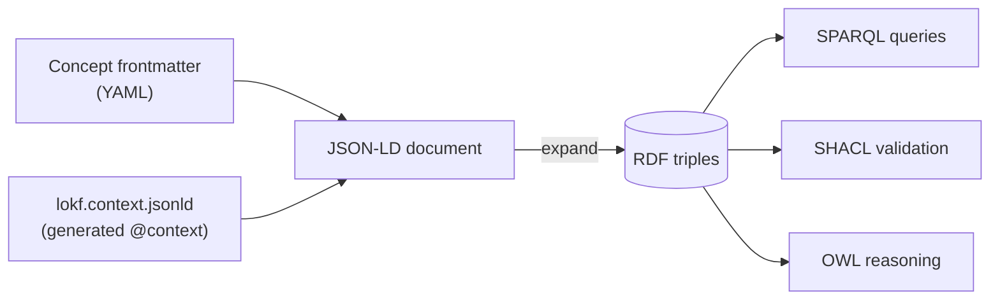

# Markdown to RDF

This is the mechanism that makes LOKF both "markdown-friendly" and
"RDF-native".

## The identity: frontmatter + context = JSON-LD

A JSON-LD document is just JSON plus an `@context` that maps its keys to IRIs.
LOKF's frontmatter keys are precisely the LinkML slots, and the generated
`lokf.context.jsonld` maps each of them to its `slot_uri`. Therefore:

No new syntax, no parallel file. The author writes OKF; the context supplies
the meaning.

## Worked example

The frontmatter of the reference bundle's WAU metric (abridged — see the
[full file](../examples.md#one-concept-end-to-end)), and the triples it
expands to:

=== "Frontmatter (YAML)"

    --8<-- "SPEC.md:worked-yaml"

=== "RDF (Turtle, abridged)"

    --8<-- "SPEC.md:worked-ttl"

The `type: Metric` field became `rdf:type lokf:Metric`; the typed relations
became `prov:`, `dcterms:`, and `lokf:` predicates pointing at other concepts'
IRIs.

## The two aliases

The published context makes exactly two changes on top of the raw LinkML
output, both standard JSON-LD keyword aliasing, so that unmodified OKF
frontmatter behaves as Linked Data:

- `type` → `@type` — OKF's required field designates the RDF class.
- `id` → `@id` — the concept's IRI is the RDF subject.

Everything else (`title`, `derivedFrom`, `tags`, …) maps to its ontology
property directly from the model.

## Do it yourself

You never have to wire the context by hand — `lokf convert` (and the
`lokf.rdf.serialize` function underneath it) does the expansion for you:

--8<-- "README.md:quickstart-rdf"

See [Convert](../toolkit/convert.md) for the full command, every output
format, and the matching `just` recipe.
