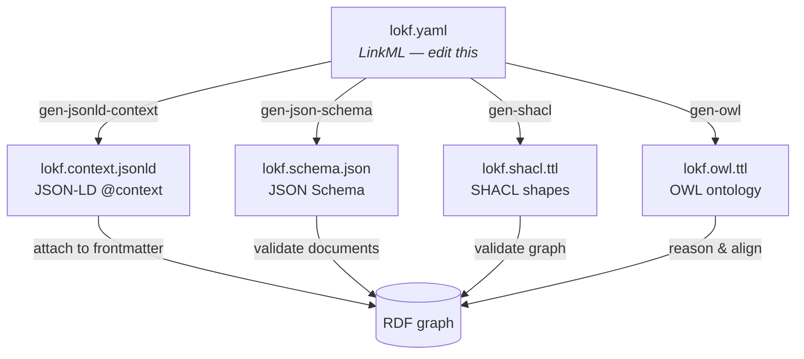

# Generated artifacts

LinkML is the **single source of truth**.
[`lokf.yaml`](https://github.com/nicholsn/lokf/blob/main/lokf.yaml) defines the
classes, slots, enumerations, and their mappings to external vocabularies.
Every other artifact is generated from it and MUST NOT be edited by hand.



| Artifact              | Generated by         | Purpose                                            |
|-----------------------|----------------------|----------------------------------------------------|
| `lokf.context.jsonld` | `gen-jsonld-context`* | Turns concept frontmatter into JSON-LD / RDF.      |
| `lokf.schema.json`    | `gen-json-schema`    | Validates concept frontmatter (JSON Schema).       |
| `lokf.shacl.ttl`      | `gen-shacl`          | Validates the resulting RDF graph (SHACL).         |
| `lokf.owl.ttl`        | `gen-owl`            | Class/property ontology for reasoning & alignment. |

\* The published context additionally aliases OKF's `type` field to the
JSON-LD `@type` keyword and `id` to `@id`, so that authoring in plain OKF
frontmatter is enough to produce correctly-typed Linked Data.

Because meaning lives in the model, adding a field or a type is a one-line
change in `lokf.yaml`; the context, schema, shapes, and ontology all
re-derive:

```bash
just build   # or: uv run lokf-build
```

!!! note "Regeneration can reorder"

    The artifacts are committed for consumers who just want to download them.
    Upstream LinkML/rdflib serialization is not byte-stable between runs
    (RDF list ordering, generation timestamps), so a rebuild may produce a
    textual diff with no semantic change — the graphs stay isomorphic.

## What the build does

The [`lokf-build`](api.md) console script chains four steps: generate the
artifacts above, assemble `examples/acme-knowledge/` into a single
`KnowledgeBundle` document, validate it with `linkml-validate`, and project it
to N-Triples in `examples/`.
