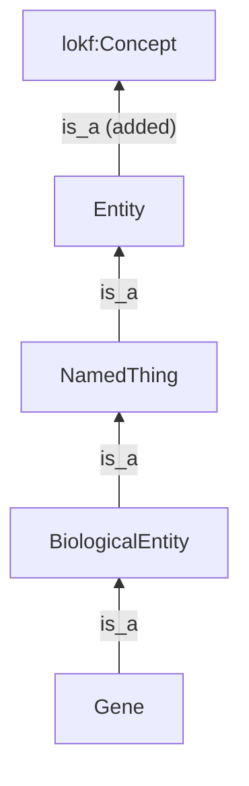

import { Content as DomainSchema } from "../../../generated/domain-schema.md";

An unknown `type` is tolerated: the concept reads as `lokf:Concept` and the
bundle stays valid. It is also meaningless, because nothing says what a
`Dashboard` is or what its keys mean. A **domain schema** gives it meaning. It
is a LinkML schema that imports `lokf.yaml` and declares the classes and
slots a domain needs beyond the [type vocabulary](/guide/types/), under the
domain's own IRIs. The same validator checks them, and the same commands
project them. The normative text is [specification §6.2](/specification/#62-domain-schemas-extending-the-vocabulary).

## A schema of your own

<DomainSchema />

`- lokf` names a copy of `lokf.yaml` beside the schema, pinned at the version
the toolkit runs. Four rules follow from how LinkML composes the two files:

1. **A domain class descends from `Concept`**, directly or through a LOKF class
   such as `Reference`. Every descendant joins the bundle's concept union, so
   the validator accepts LOKF's classes plus yours.
2. **A shared name is renamed and keeps its IRI.** LinkML merges imports into
   one namespace, so a `Person` or `title` the domain declares silently
   replaces LOKF's. Rename the element and keep its `class_uri` or
   `slot_uri`: the name is local to the schema, the IRI carries the meaning.
3. **A key needs a class that declares it.** Classes are closed, so a LOKF
   class with one extra key fails. Subclass it, declare the key on the
   subclass, and write the subclass's name in `type`.
4. **A relation slot ranges over `Concept`** or a subclass, so its values
   project as IRIs and `--check-refs` resolves them. A slot ranged over a type
   such as `string` holds a literal.

Every command that reads the vocabulary takes the schema as `--schema`:

```bash
lokf validate knowledge --schema analytics.yaml --check-refs
lokf convert  knowledge --schema analytics.yaml --format ttl
lokf query    knowledge --schema analytics.yaml "SELECT ?s WHERE { ?s a analytics:Dashboard }"
lokf serve    knowledge --schema analytics.yaml
```

Under it a `Dashboard` projects as `a analytics:Dashboard` and `shows` as
`analytics:shows`. Without it the same file reads as `lokf:Concept` with
`additionalType: Dashboard`, and `shows` is a string. Both readings are
conformant; the schema is the consumer's, the bundle's files do not change.

## Adopting a published vocabulary

A domain schema can import a published LinkML vocabulary instead of, or as
well as, declaring classes of its own. Rule 2 applies to the whole
vocabulary at once, and how rule 1 applies depends on the vocabulary's
shape. There are two.

### Classes without an identifier

[gist](https://github.com/lmodel/gist), Semantic Arts' upper ontology in
LinkML, has classes with no `id` slot, so a concept cannot take one as its
`type` directly. Bridge each class you use with a `Concept` subclass that
mixes it in and pins its IRI, and range its relation slots over `Concept`:

```yaml title="enterprise.yaml"
imports: [linkml:types, lokf, gist_core]   # gist_core: the copy gist releases for LOKF
classes:
  GistRequirement:
    is_a: Concept
    mixins: [Requirement]
    class_uri: gist:Requirement
    slots: [is_governed_by]
    slot_usage:
      is_governed_by: {range: Concept}
```

gist ships that copy with each release, its `Person`, `Organization`, `name`,
`description` and `license` renamed and their `gist:` IRIs kept.

### A vocabulary with its own root

[Biolink-model](https://github.com/biolink/biolink-model), the best-known
LinkML schema, is the other shape. Its root `entity` already carries `id`,
`name`, `description` and `type`, and biolink has a type designator of its
own, `category`. Nothing needs bridging; the copy needs re-rooting. The
toolkit does it:

```bash
lokf adapt biolink_model.yaml
```

```text
biolink_model.yaml (Biolink-Model 4.4.4) -> biolink_model_lokf.yaml
  folded imports:          attributes
  dropped for LOKF's:      id, type
  detached from a dropped: category
  demoted designators:     category
  renamed, IRIs kept:      agent -> BiolinkAgent, dataset -> BiolinkDataset, unit -> biolink_unit, name -> biolink_name, ...
  re-rooted on Concept:    Entity
  tree_root removed:       KnowledgeGraph, MappingCollection
  canonical names:         836
  verified beside lokf.yaml
Import it from a domain schema beside lokf.yaml:
  imports: [linkml:types, lokf, biolink_model_lokf]
```

Each line is one of the [moves](/toolkit/adapt/#what-it-changes). The one
that matters most is the shortest: `entity` becomes a subclass of `Concept`,
and the 265 biolink classes that descend from it join the concept union. Its
51 mixins do not; a mixin is never a concept itself, the class that mixes it
in is.



The domain schema then declares nothing of its own:

```yaml title="genomics.yaml"
id: https://acme.example/schema/genomics
name: genomics
imports: [linkml:types, lokf, biolink_lokf]
default_prefix: genomics
prefixes:
  genomics: https://acme.example/schema/genomics/
  linkml: https://w3id.org/linkml/
```

and a gene is an ordinary concept file:

```markdown title="knowledge/genes/brca1.md"
---
type: Gene
category: [biolink:Gene]
title: BRCA1
biolink_name: BRCA1
symbol: BRCA1
xref: [HGNC:1100]
in_taxon: [NCBITaxon:9606]
status: stable
---
# BRCA1
```

:::note[Two type keys]
`type: Gene` is LOKF's designator, and validation matches the class by it.
`category` is biolink's own required list, kept as biolink wrote it, so a
biolink consumer reads the file too. `biolink_name` is biolink's `name`,
renamed because LOKF has a `name`; it still projects as `rdfs:label`.
:::

`lokf validate knowledge --schema genomics.yaml --check-refs` passes, and
`lokf convert` gives:

```turtle
<https://acme.example/genomics/genes/brca1> a biolink:Gene ;
    rdfs:label "BRCA1" ;
    schema:name "BRCA1" ;
    schema:creativeWorkStatus "stable" ;
    biolink:category "biolink:Gene"^^xsd:anyURI ;
    biolink:in_taxon <http://purl.obolibrary.org/obo/NCBITaxon_9606> ;
    biolink:symbol "BRCA1" ;
    biolink:xref "HGNC:1100"^^xsd:anyURI .
```

A class-ranged slot (`in_taxon`) projects as an IRI, a `uriorcurie` one
(`xref`) as a literal, and LOKF's trust fields sit beside biolink's terms on
the same subject. A stock LOKF `Dataset` in the same bundle can be `about`
the gene, and `--check-refs` resolves a LOKF relation on a biolink class.

:::tip[Try it]
`just biolink` in the lokf repository fetches biolink-model 4.4.4 at its tag,
runs `lokf adapt`, and validates and projects `examples/biolink/`. Nothing
upstream is committed.
:::

## Keeping the copy current

The copy is a generated file. Its renames depend on what `lokf.yaml` defines
and its content on the vocabulary's release, so re-run `lokf adapt` when
either moves and commit the result. `lokf adapt VOCAB -o COPY --check` exits
1 when the copy is stale or no longer verifies, which is the CI job to add.
