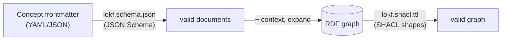

Two independent, generated validators are available — one before RDF
projection, one after.



## JSON Schema — before projection

[`lokf.schema.json`](https://github.com/nicholsn/lokf/blob/main/lokf.schema.json)
validates a concept's frontmatter, or a whole bundle serialized against the
`KnowledgeBundle` root:

```bash
# Whole bundle (assembled by `just build`)
uv run linkml-validate -s lokf.yaml -C KnowledgeBundle examples/acme-knowledge.bundle.json
# -> No issues found

# Single concept against its class
uv run linkml-validate -s lokf.yaml -C Metric metric.json
```

## SHACL — after projection

[`lokf.shacl.ttl`](https://github.com/nicholsn/lokf/blob/main/lokf.shacl.ttl)
validates the RDF graph *after* projection, catching cardinality, datatype,
and range violations at the triple level.

## Conformance in brief

A bundle is **LOKF v0.1 conformant** if:

1. It is a conformant **OKF v0.1** bundle: every non-reserved `.md` file has
   parseable YAML frontmatter with a non-empty `type`.
2. Every `type` value that names a LOKF class is used consistently with that
   class's mappings; unknown types are permitted and treated as
   `lokf:Concept`.
3. The bundle-root `index.md` declares `base_iri` and `context` if the bundle
   is to be consumed as Linked Data. (A bundle without them is still
   LOKF-conformant, but is consumed as plain OKF.)
4. Typed relation fields, when present, use the predicates the spec defines.

:::tip[Consumers stay permissive]
As in OKF, missing optional fields, unknown `type` values, unknown
frontmatter keys, and broken cross-links MUST NOT cause rejection.
:::

The normative text lives in the [specification](/lokf/specification/).
