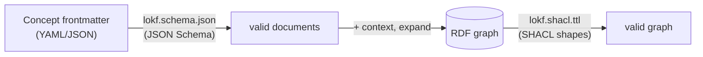

Two independent, generated validators are available — one before RDF
projection, one after.


```mermaid
flowchart LR
    A["Concept frontmatter<br/>(YAML/JSON)"] -- "lokf.schema.json<br/>(JSON Schema)" --> B["valid documents"]
    B -- "+ context, expand" --> C[("RDF graph")]
    C -- "lokf.shacl.ttl<br/>(SHACL shapes)" --> D["valid graph"]
```

## JSON Schema — before projection

[`lokf.schema.json`](https://github.com/nicholsn/lokf/blob/main/lokf.schema.json)
validates a concept's frontmatter, or a whole bundle serialized against the
`KnowledgeBundle` root:

`lokf validate` does the assembly for you — point it at any bundle directory
and it resolves the schema itself (a local `lokf.yaml`, else the copy inside the
installed package):

```bash
lokf validate knowledge
# -> OK — 2 concepts in knowledge validate against KnowledgeBundle.
```

A project with a domain schema declares it once, in the `pyproject.toml` that
pins `lokf`, and every command that reads the bundle uses it when no `--schema`
is passed: `validate`, `convert`, `query`, `serve`, `export` and the MCP
server. The verdict then names the schema, so a run against core LOKF alone is
never mistaken for one against the domain's:

```toml
[tool.lokf]
schema = "domain.yaml"   # relative to this file
```

```bash
lokf validate knowledge
# -> OK — 2 concepts in knowledge validate against KnowledgeBundle (domain.yaml).
```

The nearest `pyproject.toml` with a `[tool.lokf]` table above the bundle
decides, so the schema is the bundle's project's wherever the command runs
from; `--schema` still wins. A declared file that does not exist is an error,
never a fall-back to core.

It validates through LinkML, which the lean core install leaves out, so install
the `build` extra to use it:

```bash
uv pip install 'lokf[build]'                          # in a project
uvx --from 'lokf[build]' lokf validate knowledge      # one-off, no install
```

Or drive the validator directly, against an already-assembled bundle document
or a single concept:

```bash
# Whole bundle (assembled by `just build`)
uv run linkml-validate -s lokf.yaml -C KnowledgeBundle examples/acme-knowledge.bundle.json
# -> No issues found

# Single concept against its class
uv run linkml-validate -s lokf.yaml -C Metric metric.json
```

## Closed-world, and two more passes

Both validators are closed-world: a concept naming a `type` or a frontmatter
key the schema does not declare fails. A project's own types and keys go in
a [domain schema](/guide/domain-schemas/), passed as `--schema`; `convert`,
`query` and `serve` take the same flag.

Schema validation sees one concept at a time, so two things escape it. Two
files declaring one `id` each validate and then merge into one subject in
the graph; `--check-ids` fails that. A relation target is just a string, so a
stale or invented IRI passes; `--check-refs` resolves every typed-relation
target in the bundle's own namespace, a relative ref or an IRI under
`base_iri`, and leaves external resources alone. Both are opt-in, so the
default verdict stays the schema's.

```bash
lokf validate knowledge --schema domain.yaml --check-ids --check-refs
```

## SHACL — after projection

[`lokf.shacl.ttl`](https://github.com/nicholsn/lokf/blob/main/lokf.shacl.ttl)
validates the RDF graph *after* projection, catching cardinality, datatype,
and range violations at the triple level.

## Conformance in brief

A bundle is **LOKF v0.2 conformant** if:

1. It is a conformant **OKF v0.2** bundle: every non-reserved `.md` file has
   parseable YAML frontmatter with a non-empty `type`.
2. Every `type` value that names a LOKF class is used consistently with that
   class's mappings; unknown types are permitted and treated as
   `lokf:Concept`.
3. The bundle-root `index.md` declares `base_iri` and `context` if the bundle
   is to be consumed as Linked Data. (A bundle without them is still
   LOKF-conformant, but is consumed as plain OKF.)
4. Typed relation fields, when present, use the predicates the spec defines.
5. When the trust, lifecycle, provenance, or computation families are present,
   they follow OKF v0.2 §5–§10. A consumer MUST read a bare `verified` mapping
   as a one-element list, and MUST NOT reject a concept for omitting any
   optional family.

:::tip[Consumers stay permissive; the validator does not]
As in OKF, a consumer MUST NOT reject a bundle for missing optional fields,
unknown `type` values, unknown frontmatter keys or broken cross-links, and
`lokf convert`, `query` and `serve` accept any conformant bundle.
`lokf validate` is stricter: a conformant bundle can fail it for an
undeclared type or key. Conformance is the floor a consumer must accept;
passing `lokf validate` is the bar a producer aims for.
:::

The normative text lives in the [specification](/specification/).
